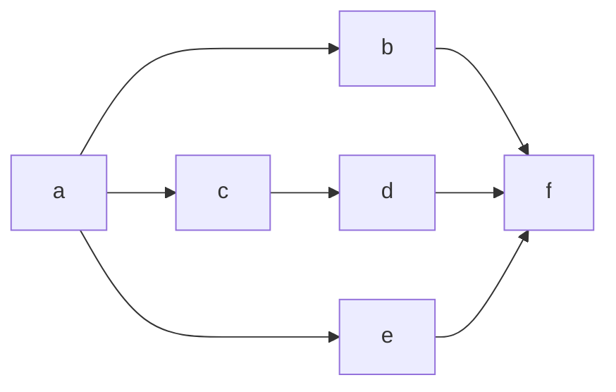

又好久都没写过 blog 了……最近因为想重构 C++ QQ bot 的 SDK，还想支持异步调用，所以看 C++ 异步编程的东西比较多，这次就接着[上次](https://chlorie.github.io/ChloroBlog/posts/2020-10-07/0-async.html)的话题再说一说异步。这次的话题仍然是围绕 asio 来展开的。

# 1. 回调地狱以及异步函数的组合

如果只需要调用单个的异步操作，asio 的模型其实比较简单易懂。比如说下面这个异步等待计时器的例子：

```cpp
asio::steady_timer timer(/*io_context*/ ioc, /*time_point*/ tp); // 构造 I/O 对象
timer.async_wait([](const std::error_code ec) // 启动异步等待
{
    if (ec == asio::error::operation_aborted) // 计时器在未完成时被取消
        fmt::print("Timer cancelled\n");
    else if (ec) // 其他错误
        fmt::print("Got error: {}\n", ec.message());
    else // 没有错误也没有取消，计时器等待完成
        fmt::print("Timer expired\n");
});
```

但是如果需要串接多个异步例程，代码就会变得复杂。比如说我们想在计时器超时之后发送一次 HTTP 请求：

```cpp
using beast::error_code;

timer.async_wait([&](const std::error_code ec) // 启动异步等待
{
    if (ec == asio::error::operation_aborted) // 计时器在未完成时被取消
        fmt::print("Timer cancelled\n");
    else if (ec) // 其他错误
        fmt::print("Got error: {}\n", ec.message());
    else // 没有错误也没有取消，计时器等待完成
        // 异步连接到端点
        stream.async_connect(endpoints, 
            [&](const error_code& ec, [[maybe_unused]] const auto& endpoint)
            {
                /* 错误处理略去 */
                // 异步写出请求
                http::async_write(stream, request,
                    [&](const error_code& ec, [[maybe_unused]] const size_t bytes_xferred)
                    {
                        /* 错误处理略去 */
                        // 异步读入响应
                        http::async_read(stream, buffer, response,
                            [&](const error_code& ec, [[maybe_unused]] const size_t bytes_xferred)
                            {
                                shutdown_socket(stream);
                                /* 错误处理略去 */
                                const std::string& body = response.body(); // 太棒了，终于读到响应了！
                                // 下面处理响应...
                            }))
                    })
            })
});
```

如果有人喜欢写这种回调地狱代码的话下面就不用看了，但是不会真有人喜欢写这种玩意吧，不会吧.jpg

上面这个例子算是比较夸张了，一般使用的时候不会这样 lambda 套娃而是会写成很多函数层层调用，不过这么简单的操作需要几个函数之间来回跳也确实不爽。而且上面的代码忽略了一个重要的问题，那就是对象生存期问题。`timer`，`stream` 等对象需要在整套流程走完之前不被销毁，这种复杂的生存期保证在这种回调函数主导的代码当中很难实现，所以在之前人们大都使用 `std::shared_ptr` 等引用计数之类的仿垃圾回收方法来保证对象生存期无误，而这种无谓的堆内存使用也是与现代 C++ 的思路相悖的。

这种回调嵌套的异步风格是很难进行组合的。比起上面那样，我们当然更希望写类似这样的代码：

```cpp
// 一个接受任何参数但不做任何事情的函数用于丢弃不想要的返回值
const auto discard = [](auto&&...) {};

// 这里假想有这么一个 ex::sequence 函数可以用来串接多个异步例程
// 注意这里并没有处理错误以及取消，ex::sequence 函数会自动将错误和取消信息向外传递
const auto sender = ex::sequence(
    timer.async_wait(ioc, tp),
    stream.async_connect(endpoints) | ex::transform(discard), // 流式写法处理返回值，这里直接丢弃返回值
    http::async_write(stream, request) | ex::transform(discard),
    http::async_read(stream, buffer, response) | ex::transform(discard)
) | // 仍然使用流式写法，sequence 异步返回的结果是其最后一个操作（async_read）的结果
ex::transform([&]([[maybe_unused]] const size_t bytes_xferred)
{
    // 这里就可以对 response 进行处理了
})

// 后面再对 sender 进行操作，比如说这时候如果想在当前线程同步等待所有操作结束
ex::sync_wait(sender);
// 或者也可以把这个 sender 返回，作为更大的异步调用图的一部分
// 用类似的手段可以构造一个异步调用的 DAG
```

这样多层嵌套的回调就变成了简单易懂的调用图，调用的串接就可以用这些泛用的“异步算法函数”实现。除了这里提到的 `sequence` 用来依次对多个异步过程进行接连的调用，`transform` 用来对异步调用的结果进行处理，还可以写出类似 `when_all(s1, s2, ...)` 的算法并发地进行多个任务，当所有任务都结束时 `when_all` 任务才算整体结束。

```cpp
const auto sender = ex::sequence(
    a, 
    ex::when_all(
        b,
        ex::sequence(c, d)
        e
    ), 
    f
);
```

上面这一段代码就对应下面这样的调用流程：



为什么 asio 默认的回调函数式流程不能很好地组合也是非常显而易见的，它的问题就在于把异步函数的参数传递、回调函数以及执行的开始放到了一个函数里面；而上面所说的 `ex::` 系列函数则是把参数传递的部分和回调函数分离，这样就方便编写类似 `ex::schedule` 之类的泛用的异步算法了。这样建立好的异步调用流程图可以用上面提到的 `ex::sync_wait` 以及 `async_scope.spawn` 之类的函数来启动执行。

（注：asio 的模型其实是可扩展的，回调函数的位置可以放一些特殊类型的值来改变函数调用的效果，比如使用 `asio::use_awaitable` 就可以让那个异步函数返回一个 `awaitable` 以便在协程中等待。要写一个适配 sender 的接口或许也不难，但是如果还需要单独传一个特殊类型的类似 `asio::use_sender` 的参数也确实不是很爽……）

# 2. Sender, receiver, operation state

有了把参数、回调和执行开始三件事情分离的思想，介绍 sender 的接口就简单许多了。上面 `ex::` 的例子是可以实现的，其核心思想就是 [P0443](http://wg21.link/p0443) 中提到的 sender/receiver 概念。一个具体的实现可以见 [libunifex](https://github.com/facebookexperimental/libunifex)。

最简单的想法就是：让单独的异步函数调用，类似 `timer.async_wait(ioc, tp)`，`http::async_read(stream, buffer, response)` 之类，实现 `sender` （发送器）概念，之所以是发送器就是因为它们负责产生值（或取消以及异常）并且发送给回调函数（接收器 `receiver`）进行处理。将发送器与接收器 `connect`（连接）返回一个执行状态对象 `operation_state`，这个对象里面包含了 sender 和 receiver 的状态以及异步过程需要的一些其他的状态。最后在 `operation_state` 上面调用 `start` 函数就可以开始整个调用流程。

```cpp
const auto sender = timer.async_wait(ioc, tp);
const auto receiver = [](error_code ec) { ... };
const auto operation_state = sender.connect(receiver);
operation_state.start();
```

这里就能看出来标准库设计的一大特点，那就是为了库使用者的方便不惜一切代价……本来一个函数调用就能完成的工作现在必须要拆成三份，但这一切都是为实现泛用异步算法所做的必须的牺牲。

把异步函数魔改成 sender 以后，我们的目光转向回调函数本身。让我们再回顾一下前面处理计时器异步等待的回调函数：

```cpp
void callback(const std::error_code ec)
{
    if (ec == asio::error::operation_aborted) // 计时器在未完成时被取消
        fmt::print("Timer cancelled\n");
    else if (ec) // 其他错误
        fmt::print("Got error: {}\n", ec.message());
    else // 没有错误也没有取消，计时器等待完成
        fmt::print("Timer expired\n");
}
```

异步函数的调用结束原因有三种：正常结束，因异常（错误）结束，以及任务被中途取消。我们一般是只对正常路径感兴趣的，而一般来讲，很多时候错误和取消我们都希望能自动地传递给上一级的调用方来处理（有没有想到 exception？）。如果能把这三个不同的返回路径分开处理的话，我们就能在其上构建自动的取消和错误传递机制了。综上所述，接收器并不应该是一个单纯的回调函数对象，而应该有三个不同的成员函数用来处理三个不同的路径。

```cpp
struct timer_result_receiver
{
    void set_result() { fmt::print("Timer expired\n"); }
    void set_done() { fmt::print("Timer cancelled\n"); }
    void set_error(const std::error_code ec) { fmt::print("Got error: {}\n", ec.message()); }
};
```

真正的 receiver 当中一般还会有一些其他的成员变量（局部状态），比如说 `stop_token` 等用来传递取消信号，或者在内部存储一个调度器用来在其上开始子任务等。

写一个 receiver 确实比写一个回调函数要麻烦，不过这一点不用担心，一般的使用者很少需要手写 receiver 的，因为我们有——

# 3. 协程和 sender/receiver

Sender/receiver 概念与协程其实是可以一一对应的。可以发送返回值的 sender 对应协程中的可等待体（awaitable），而接收返回值的回调函数嘛，你看处在挂起状态等待恢复执行的协程句柄像不像回调函数？传递错误信息的通道就是异常了，使用异常来传递错误甚至还有可以自动传递错误给上级的好处；传递取消信号这一点比较麻烦，不过好好设计一番也可以让协程支持这一点。

```cpp
ex::task<void> task()
{
    try
    {
        co_await timer.async_wait(ioc, tp);
        // 如果执行到这一句那就证明前面的等待使用成功路径返回
        // recv.set_value()
        fmt::print("Timer expired\n");
    }
    // 这里捕获异常，如果捕获到异常就说明异步函数调用使用错误路径返回
    // recv.set_error(std::make_exception_ptr(std::system_error(ec)))
    catch (const std::system_error& err)
    {
        fmt::print("Got exception: {}\n", err.what());
    }
}

ex::task<void> caller()
{
    // stop_when 函数接受两个 sender，并行地执行这两个 sender
    // 并且当其中一个运行结束时会给另一个发送取消信号 (set_done)
    co_await ex::stop_when(
        task(),
        wait_for(10s);
    );
    // task() 有可能直接因为超时被 ex::stop_when 取消
    // 此时取消信号传递到 task() 中，task() 将取消信号传递给
    // 它正在等待的 `timer.async_wait` 并执行取消
    // recv.set_done()
}
```

# 4. 所以到底怎么才能打断高速咏唱

铺垫了这么多终于要到正题了，这次我想给 `asio::steady_timer` 适配一个 sender 的接口，同时还要支持取消功能。使用例的话就下面这个吧：

```cpp
using Clock = std::chrono::steady_clock;

auto wait_for(asio::io_context& ctx, const Clock::duration dur)
{
    return WaitUntilSender(ctx, Clock::now() + dur);
}

// 这里每半秒钟高速咏唱一行歌词
ex::task<void> rickroll(asio::io_context& ctx)
{
    for (const auto line :
         {
             "Never gonna give you up",
             "Never gonna let you down",
             "Never gonna run around and desert you",
             "Never gonna make you cry",
             "Never gonna say goodbye",
             "Never gonna tell a lie and hurt you"
         })
    {
        fmt::print("{}\n", line);
        co_await wait_for(ctx, 500ms);
    }
}

ex::task<void> task(asio::io_context& ctx)
{
    // 这里开始高速咏唱，但是如果超过 2s 了就直接打断
    co_await ex::stop_when(
        rickroll(ctx),
        wait_for(ctx, 2s)
    );
}
```

下面就是我的实现了，具体解释请看注释：

```cpp
class WaitUntilSender final
{
public:
    // typed_sender 概念需要一个成员类型别名模板 value_types
    // 表明当前这个 sender 类型都能返回什么类型（以什么参数调用 receiver 的 set_value 函数）
    // Var 代表 variant 也就是不同的调用参数变体
    // Tup 代表 tuple 也就是调用参数构成的元组
    // sender 是可以用多个参数调用 set_value 来“同时返回多个值”的
    // 比如，如果可能以 set_value() set_value(int) set_value(int, float) 这几种参数调用
    // 那 value_types 应该定义成 Var<Tup<>, Tup<int>, Tup<int, float>>
    // 这里因为计时器等待只可能返回 void，对应 set_value() 这样的调用，所以就是 Var<Tup<>>
    template <
        template <typename...> typename Var,
        template <typename...> typename Tup>
    using value_types = Var<Tup<>>;

    // 同样，这里 error_types 指明当前 sender 可能报何种类型的错误，一般异常就是 std::exception_ptr
    // 规定 set_error 函数只能接受一个参数，所以 error_types 并没有 Tup 参数
    template <template <typename...> typename Var>
    using error_types = Var<std::exception_ptr>;

    // sends_done 指明当前 sender 会不会发送 done（取消）信号，我们想支持取消所以这里应该是 true
    static constexpr bool sends_done = true;

    // 这个类就是 operation state 了
    template <typename Recv>
    class Operation final
    {
    private:
        // 取消路径的回调函数对象类型
        struct Stopper final
        {
            WaitUntilSender& sender;

            // 这里如果 operation 被取消的话就直接调用计时器的 cancel 函数
            void operator()() const
            {
                // 注意用 strand 同步在 timer_ 上的操作
                asio::execution::execute(sender.strand_,
                    [&t = sender.timer_]() { t.cancel(); });
            }
        };

        // receiver 类型会对应一个 stop_token 类型用来传递取消信号
        // stop_token 类型会包含一个 callback_type 类型别名模板
        // 使用这个 callback_type 包装回调函数则会将对应的回调函数注册到
        // stop_token 的列表中，当 stop_token 被请求取消时这些注册上的回调函数就会被调用
        using Callback = typename ex::stop_token_type_t<Recv&>::template callback_type<Stopper>;

        WaitUntilSender& send_;
        Recv recv_;
        std::optional<Callback> cb_; // 用 optional 分离取消回调的生存期

        Recv&& receiver() { return static_cast<Recv&&>(recv_); }

    public:
        Operation(WaitUntilSender& send, Recv&& recv):
            send_(send), recv_(static_cast<Recv&&>(recv)) {}

        // start 函数，调用这个函数来真正地启动异步过程
        void start() & noexcept
        {
            try
            {
                // 在接收器 recv_ 对应的 stop_token 上注册取消回调
                // 传递上游的取消请求
                cb_.emplace(ex::get_stop_token(recv_), Stopper{ send_ });

                // 要包装的 timer.async_wait 就是这个了
                // 同样注意使用 strand 同步
                send_.timer_.async_wait(asio::bind_executor(send_.strand_,
                    [this](const std::error_code ec) // 非常熟悉的回调函数……
                    {
                        // 分别将三种返回路径接到 receiver 上
                        // 这里使用 CPO 调用 ex::set_xxx(receiver())
                        // 而不是直接成员函数调用 receiver().set_xxx()，提升泛用性
                        if (ec == asio::error::operation_aborted)
                            ex::set_done(receiver());
                        else if (ec)
                            ex::set_error(receiver(), std::make_exception_ptr(std::system_error(ec)));
                        else
                            ex::set_value(receiver());
                    }));
            }
            // async_wait 的调用本身出了奇怪的异常，向上传递
            catch (...) { ex::set_error(receiver(), std::current_exception()); }
        }
    };

private:
    // strand 用来同步对同一个对象的操作
    // 因为取消计时器的线程可能跟启动计时器的线程不一样所以一定要用某种手段同步
    // 这里用互斥锁 mutex 也可以，不过还是建议用 strand
    asio::strand<asio::io_context::executor_type> strand_;

    // 计时器对象，没什么好说的（
    asio::steady_timer timer_;

public:
    WaitUntilSender(asio::io_context& ctx, const Clock::time_point tp):
        strand_(make_strand(ctx)), timer_(ctx, tp) {}

    // 前面提到的 connect 函数，用来连接发送器和接收器的状态
    // 实际的启动函数 start 在 Operation 中实现
    template <ex::receiver Recv>
    Operation<Recv> connect(Recv&& recv) noexcept { return { *this, static_cast<Recv&&>(recv) }; }
};
```
